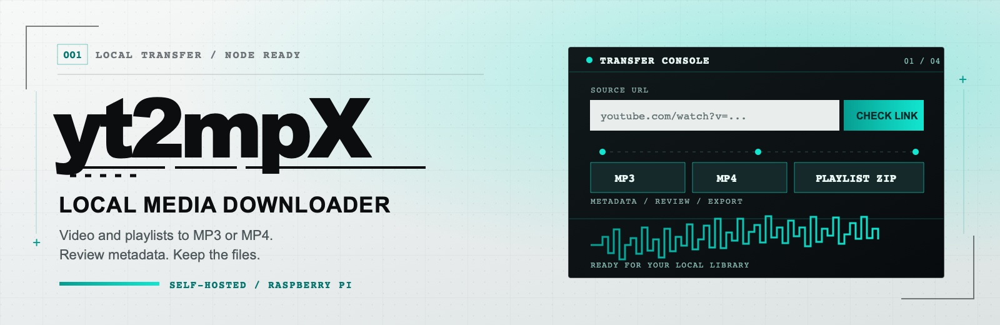

# yt2mpX

A local web app for Raspberry Pi: paste a YouTube video or playlist URL, choose MP3 or MP4, review the metadata, and download the finished file in your browser.

> Only use this app for content you are allowed to download.

## Getting started

```bash
docker compose up --build
```

Open the app on your home network:

```text
http://<pi-ip>:8000
```

On the development machine, open `http://localhost:8000`.

## How it works

1. Check a video or playlist URL. Choose the format, quality, and playlist items.
2. The app downloads and converts the media. With an AcoustID key, it tries to identify each track using Chromaprint/fpcalc, AcoustID, and MusicBrainz. Without a key or a confident match, it uses metadata from YouTube.
3. Review and edit the suggested title, artist, album, date, track and disc numbers, ISRC, cover URL, and MusicBrainz IDs. The app writes the tags and prepares the final download.

Playlist items can be selected with checkboxes or ranges such as `1-20`, `1-20,45,60`, and `4,8,12`. Playlists are delivered as ZIP files. The app shows the download size and, for ZIP files, the approximate extracted size. Temporary downloads are listed in the browser's history panel while they remain available on the server.

For cover art, the app tries MusicBrainz/Cover Art Archive first and falls back to the YouTube thumbnail if needed. MP3 cover art is optional. MP4 downloads prefer H.264/AAC for compatibility with QuickTime, iOS, and macOS, but may use another format when needed. Single videos are named `Title - Artist`; playlist files omit the YouTube ID and duplicate titles receive a numeric suffix.

Multiple browsers or devices can start jobs at the same time. Finished jobs are removed after `YTMPX_JOB_TTL_MINUTES` from their last update; cleanup runs every five minutes.

## Configuration

The main settings are in `docker-compose.yml`. You can add other environment variables if needed:

- `YTMPX_JOB_TTL_MINUTES`: How long completed downloads remain on the Pi (30 minutes in Docker Compose).
- `YTMPX_MAX_PLAYLIST_ITEMS`: Maximum number of playlist items per job (100 in Docker Compose).
- `YTMPX_PROBE_TIMEOUT_SECONDS`: Link check timeout (default: 75 seconds; not set in Docker Compose).
- `YTMPX_YTDLP_SOCKET_TIMEOUT_SECONDS`: yt-dlp network timeout (default: 30 seconds; not set in Docker Compose).
- `YTMPX_ACOUSTID_API_KEY`: AcoustID Application API Key for audio fingerprint matching. The app still works without it, using fallback metadata.
- `YTMPX_MUSICBRAINZ_USER_AGENT`: MusicBrainz user agent, ideally with contact information.
- `./downloads:/data`: Local storage for temporary job files. Completed jobs are stored under `./downloads/jobs/<job_id>/`.

To configure these integrations, copy the template to `.env` and edit its values:

```bash
cp -n .env.example .env
```

Docker Compose reads `.env` automatically. To enable fingerprint matching, sign in to AcoustID and [register an application](https://acoustid.org/new-application). Put its **Application API Key** in `YTMPX_ACOUSTID_API_KEY` (not your AcoustID user key). Leave this field empty to use fallback metadata.

MusicBrainz does not require an API key for metadata lookups. Set `YTMPX_MUSICBRAINZ_USER_AGENT` to an application name and version with a contact URL or email address, following the [MusicBrainz User-Agent guidelines](https://musicbrainz.org/doc/MusicBrainz_API/Rate_Limiting#Provide_meaningful_User-Agent_strings).

Keep `.env` private; only `.env.example`, which contains no credentials, belongs in Git.

## Quality options

- MP3 **High**: high VBR quality (`VBR 0`).
- MP3 **Medium**: approximately 192 kbps; the default.
- MP3 **Low**: approximately 128 kbps.
- MP3 **Minimal**: uses the smallest audio source and targets 32 kbps.
- MP4 **Best compatibility**: prefers the best available H.264/AAC variant.
- MP4 **1080p**, **720p**, or **360p**: prefers H.264/AAC and tries to limit video height. As a last fallback, another resolution may be selected.

MP3 quality and the cover-art option are saved in a browser session cookie. The temporary-download history uses an ID stored in the browser's local storage.

## Notes

- Private or age-restricted content may need cookie support, which is not implemented yet.
- Version 1 has no login. Run it only on a trusted home network.
